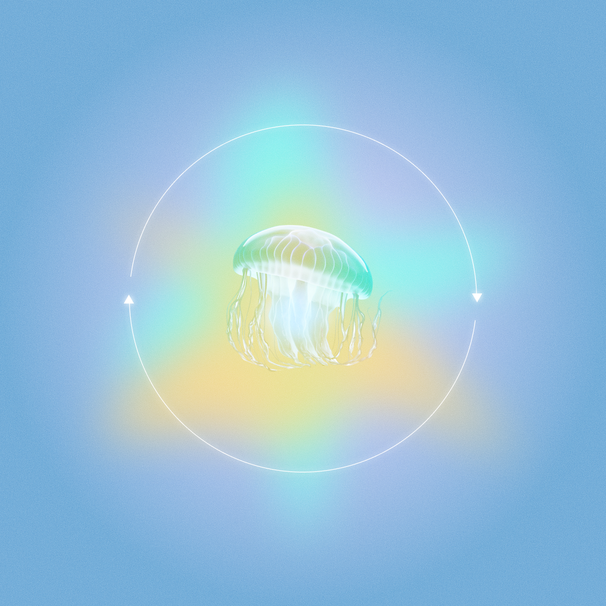

> “You must have chaos within you to give birth to a dancing star.”
>
> ― Friedrich Nietzsche

    

## Hi, I'm Airi

A technical artist at Respawn working on Apex Legends and Star Wars Jedi with Computer Science background from University of Southern California.

I’m interested in learning and creating graphics work that can enable story-telling or mechanisms in game development. At the intersection of art & tech, I've done visual effects, physics simulation, shaders, tools scripting, and performance optimization for personal and team projects. Open to any challenges in the graphics space:)

My biggest hobby is learning, and my second one is solving puzzle games - whether it's boardgame or video game. Outside of work, I'm a plant mom who enjoys reading philosophy/classical novels and drawing things/people/memories I love.

Feel free to reach out to discuss whatever swe, games, or graphics stuff via [LinkedIn](https://www.linkedin.com/in/phuong-pham-airi/), [Insta](https://www.instagram.com/shaderwitch/) or [phamairi@gmail.com](phamairi@gmail.com)

## Experience
- Associate Technical Artist at Respawn - EA (July 2025 - now)
- Technical Artist Intern @ Respawn - EA (Summer 2024)
- Software Engineer Intern @ Goldman Sachs (Summer 2022 & 2023)

## Skills
I have experience on both art and technical sides, leaning towards the second more.
- Languages: C#, C++, Python, Java, Javascript
- Game Engine: Unreal, Unity
- Graphics API: OpenGL, DirectX11
- 3D Software: Maya, Houdini
- Fullstack: HTML, CSS, NextJS, SpringBoot
